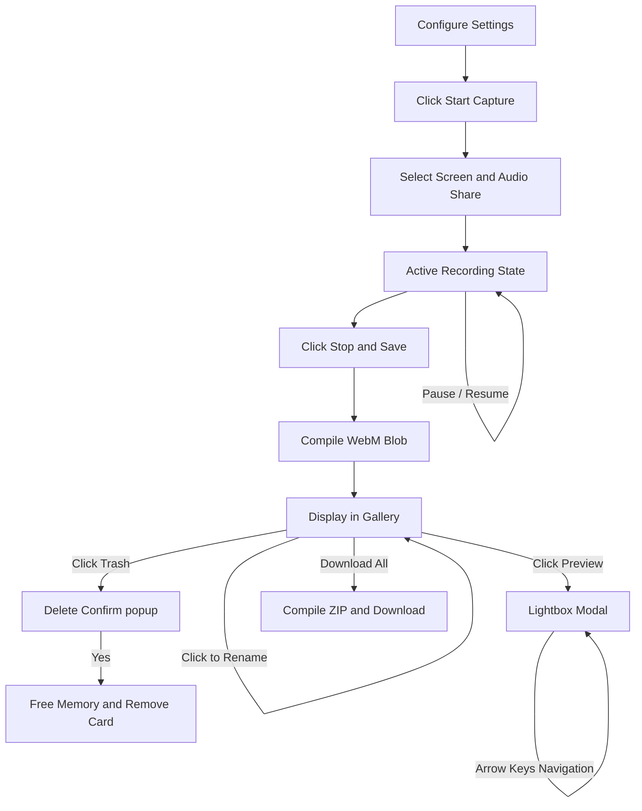

# Video link
Click Here 👉 https://youtu.be/nPXXOz-qQys?si=f5qsVCiSbX3l6HH0

---

# Hosted link
Click Here 👉 https://chrome-screen-recorder-gamma.vercel.app/

---

# ScreenRecorder

A clean, responsive, and completely client-side screen and audio recorder. This application runs entirely in your web browser with **zero external libraries or CDNs**, meaning your data never leaves your computer, ensuring maximum speed and complete privacy.

---

## 📝 Summary

ScreenRecorder is a single-page utility tool that helps users record their screen displays (desktop, window, browser tab) alongside microphone voiceovers. It features a customizable settings dashboard, a real-time live preview window, and an interactive recordings gallery. The list of recordings supports reordering, inline renaming, fullscreen modal previews, individual downloads, and batch ZIP archiving.

---

## 🌟 Features

* **Custom Quality Presets**: Select from high-definition presets including 1080p at 60 FPS, 1080p at 30 FPS, 720p, and 480p to fit your computer’s performance.
* **Audio Track Mixer**: Automatically merges system/tab audio and microphone voice tracks together in real-time.
* **Always-Visible Navigation Arrows**: Fullscreen player includes left (`<`) and right (`>`) overlay buttons to cycle between recordings. These automatically disable if you only have one video.
* **Keyboard Hotkeys**: Cycle through previews using your keyboard’s **Left Arrow** and **Right Arrow** keys, or close the player with the **Escape** key.
* **Inline Renaming**: Click a recording's title to swap it with a square-corner input field. The text cursor automatically selects the name while leaving out the `.webm` extension for fast typing.
* **Drag-and-Drop Reordering**: Drag recording cards using their grab handle (`≡`) to change their list sequence.
* **Delete Confirmation Modal**: Protects you from deleting recordings by accident with a custom popup window. Deleting a video frees up browser memory automatically.
* **ZIP Downloads**: download all recorded video inside a single `.zip` file compiled from scratch using binary JavaScript.

---

## 🛠️ Tech Stack

* **Frontend**: HTML5, Vanilla CSS3, modern Vanilla JavaScript (ES6+).
* **Browser APIs**:
  * **Screen Capture**: `navigator.mediaDevices.getDisplayMedia`
  * **Microphone Capture**: `navigator.mediaDevices.getUserMedia`
  * **Media Recording**: `MediaRecorder`
  * **Audio Processing**: Web Audio API (`AudioContext`)
  * **File Access**: Object URLs (`URL.createObjectURL`)
  * **Binary Archiving**: `ArrayBuffer` & `DataView`

---

## 📂 Project Structure

The project has a minimalist, three-file architecture:

```
screen-recorder/
├── index.html     # Semantic elements, vector SVG icons, and modal dialogue overlays.
├── style.css      # Design tokens, center layout grid, buttons, and animations.
└── app.js         # Capture states, audio nodes, list management, and binary ZIP packer.
```

---

## ⚙️ How It Works

1. **Media Capture**: The app calls the browser's capture engines to fetch video and audio tracks from the screen.
2. **Audio Mixing**: If the microphone toggle is turned on, the app creates a virtual `AudioContext` and connects both the screen audio track and the microphone audio track into a single destination node to combine them.
3. **Data Recording**: Combined streams are fed into a `MediaRecorder` object, which saves data chunks every second. When stopped, these chunks are combined into a `.webm` file.
4. **Local Archiving**: The ZIP generator reads each file as an `ArrayBuffer` and creates a compliant ZIP file structure. It calculates a standard CRC-32 checksum and writes standard headers directly in the browser's memory.

---

## 🔄 Project Workflow



---

## 📸 Implementaion Screenshots

## Step: 1 Select the quality of the video you want to record.


## Step: 2 Select whether you want to record audio.


## Step: 3 Click "Start Capture" to start recording.


## Step: 4 choose which table whould you like to record.


## Step: 5 Allow microphone access.


## Step: 6 Click "Pause" to pause your screen recording.


## Step: 7 Click "Resume" to Resume your screen recording


## Step: 8 Click "Stop & Save" to Save your screen recording.


## Step: 9 Double-click the video title to rename the recorded video.


## Step: 10 Click and drag the hamburger icon to rearrange the videos.


## Step: 11 Click "Preview" to view your recorded video


## Step: 12 Click the Left Navigation button to navigate left or Right.


## Step: 13 Click "Download" to Download your recorded video.


## Step: 14 Click "Delete" to Delete your recorded video.


## Step: 15 Click "Delete" to Conform Delete your recorded video.


## Step: 16 Click "Download All as ZIP" to download all your recordings as a single ZIP file.


---

## 🌐 Testing (Browser Compatibility)

| Browser | Screen Sharing | Mic Mixing | ZIP Compilation | Keybindings |
| :--- | :--- | :--- | :--- | :--- |
| **Google Chrome** | ✅ Yes | ✅ Yes | ✅ Yes | ✅ Yes |
| **Microsoft Edge** | ✅ Yes | ✅ Yes | ✅ Yes | ✅ Yes |
| **Mozilla Firefox** | ✅ Yes | ✅ Yes | ✅ Yes | ✅ Yes |
| **Apple Safari** | ✅ Yes (macOS 13+) | ✅ Yes | ✅ Yes | ✅ Yes |

---

## 🔮 Future Implementations

* **Drawing Annotations**: Add overlay pens, arrows, and highlighters to draw on the screen while recording.
* **Recording Hotkeys**: Set keyboard combinations (like `Ctrl` + `Alt` + `R`) to quickly start or stop recording.
* **Sound Filters**: Add noise cancellation and echo removal filters directly into the microphone audio node.
* **Alternate Formats**: Add support to export/convert video files into MP4 or MKV formats.

---

## 🎓 Learning Outcomes

* **Audio Mixing Nodes**: Learned how to mix multiple screen and hardware audio inputs together using Web Audio API nodes.
* **Binary File Formatting**: Gained experience working with `ArrayBuffers`, `DataViews`, and calculating CRC-32 tables to build valid ZIP archives client-side.
* **DOM State Syncing**: Learned to build drag-and-drop lists, inline text fields, and modals in pure JavaScript without relying on libraries like React or jQuery.
* **Responsive Styling**: Standardized spacing, flexboxes, and media queries to center layouts and prevent text cutoff bugs.

---

## 👤 Author

* **Krishna Yadav**
